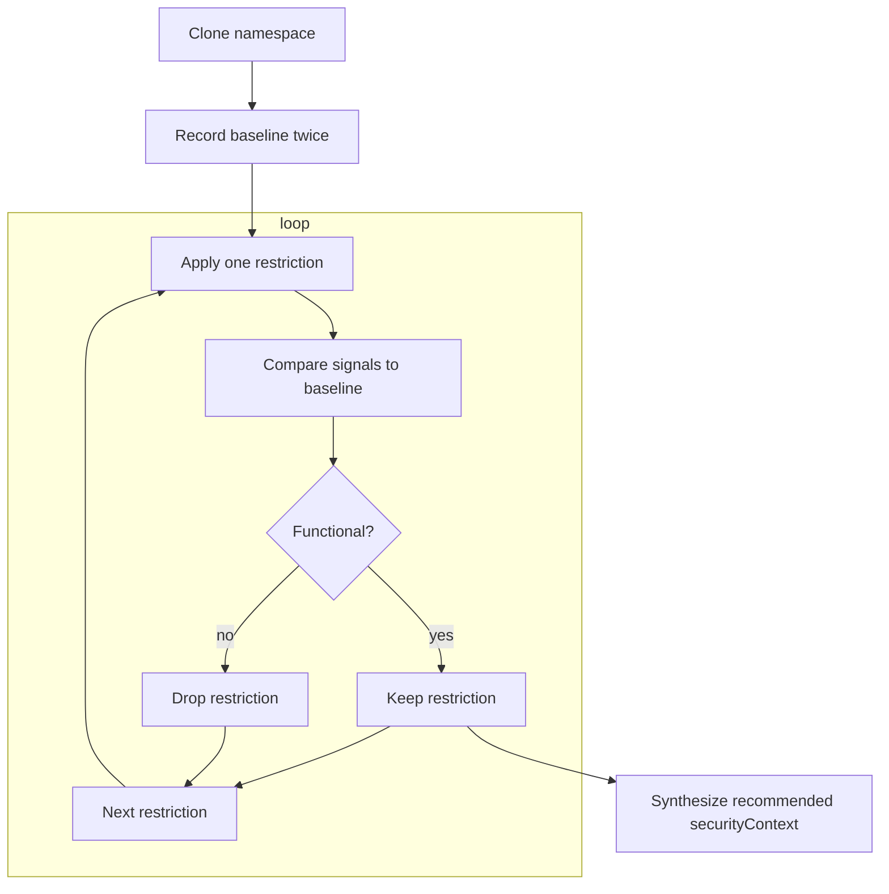

# Automated Kubernetes Workload Hardening Using a Functionality Oracle

> "We just want to deploy securely — but end up fixing someone else's YAML"

Mathias Petermann &nbsp; <small>&lt;mathias.petermann@gmail.com&gt;</small>

Sebastian Graf &nbsp; <small>&lt;sebastian.graf@fhnw.ch&gt;</small>

School of Computer Science, FHNW

September 2026

---
layout: image-left
image: /theres-no-container.jpg
backgroundSize: contain
---

## Why Bother, Part 1 ?

Containers are not intended to isolate against the host without specialized settings:

- on kernel-level: 
`cgroups`, `chroot`, `namespaces`
- within K8: 
`securityContext`

If not set, workloads might interfer with each other on same host.

<!--
chroot, cgroups and namespaces...

`securityContext` cuts the attack surface:
  - non-root users
  - read-only root filesystems
  - dropped Linux capabilities
  - Applied manually → error-prone and often skipped.
-->

---
layout: image-right
image: /workloads.drawio.svg
backgroundSize: 20em 80%
---

## Why Bother, Part 2 ?

Responsibilities of Platform and Application is distributed over teams:

- on top: business teams focussing on application
  - focus on business requirements best
  - focus not on platform best practices
- on bottom: platform team, caring about platform for multiple applications
  - no / few application knowledge
  - need to guarantee integrity and resilience of entire platform

<!--
- Use Case: Platform team deployes internal / third party workload
  - Application not really known to platform owner
  - Howerver: platform owner wants to have secure deployed workloads not interfering with other workloads
  - securityContext to rescue...but how to apply?
Credit: https://martinfowler.com/articles/platform-teams-stuff-done.html
-->

---
layout: two-cols
---

## The Gap

- No **generic, automated** way to prove a workload still works under restrictive settings.
- Every restriction is a gamble: it might break the app at runtime.

> **Goal:** maximize security without breaking functionality — automatically.

::right::

| Field | Description |
| --- | --- |
| `allowPrivilegeEscalation` | Controls whether a process can gain more privileges than its parent, such as via setuid binaries. Container level only. |
| `capabilities` | Allows fine-grained control over Linux capabilities (e.g., `NET_ADMIN`, `SYS_TIME`). Container level only. |
| `fsGroup` | Defines a group ID used for setting group ownership of mounted volumes. Pod-level only. |
| `fsGroupChangePolicy` | Defines behavior of changing ownership and permission of the volume before being exposed inside Pod. Pod-level only. |
| `privileged` | Grants the container full access to the host, disabling most isolation mechanisms. Only available at the Container level. |
| `readOnlyRootFilesystem` | Mounts the containers root file system as read-only. Prevents write access to root-level paths. Container level only. |
| `runAsGroup` | Specifies the GID to run the container process. Useful for filesystem permissions. Applicable at Pod or Container level. |
| `runAsNonRoot` | Ensures the container does not run as root (user ID 0). Kubernetes will reject the Pod if no user ID is set. Applicable at Pod or Container level. |
| `runAsUser` | Specifies the UID to run the entrypoint of the container process. Applicable at Pod or Container level. |
| `seLinuxOptions` | Specifies SELinux labels for process confinement. Requires SELinux-enabled hosts. Usable at Pod or Container level. |
| `seccompProfile` | Applies a Seccomp profile to limit available syscalls. Usable at Pod or Container level. |
| `supplementalGroups` | List of additional GIDs the container will be part of. Useful for shared volume access. Pod-level only. |
| `supplementalGroupsPolicy` | Defines how supplemental groups are calculated. Promoted to Beta in Kubernetes 1.33. |
| `sysctls` | Defines kernel parameters for the Pod. Only safe, allow-listed sysctls are permitted. Pod-level only. |

<!--
- Kubernetes gives us powerful runtime restrictions via `securityContext`.
- Restrictions **only fail at runtime** — no compile-time, no static analysis.
- Conventional verification needs app-specific knowledge + integration tests.
-->

---
layout: image-right
image: /orakle-of-funk.png
backgroundSize: contain
---

## The idea 

Treat functional correctness as a **black box** and **orakle** about its correctness:

1. Record a **baseline** of a known-good workload.
2. Apply **one** runtime restriction at a time.
3. **Compare** observed behavior against the baseline.
4. Aggregate successful restrictions → recommended `securityContext`.

--> No internal knowledge of the app required.. 
--> (however...correct behaviour is assumed, not proved...) 
-->(well...is software correctness ever proved?)

---

## What Comes Out

A ready-to-apply, workload-agnostic recommendation:

- `podSecurityContext` + container `securityContext`
- Built only from restrictions that provably kept the app working
- Enables **secure-by-default** deployments

---

## The Loop

---