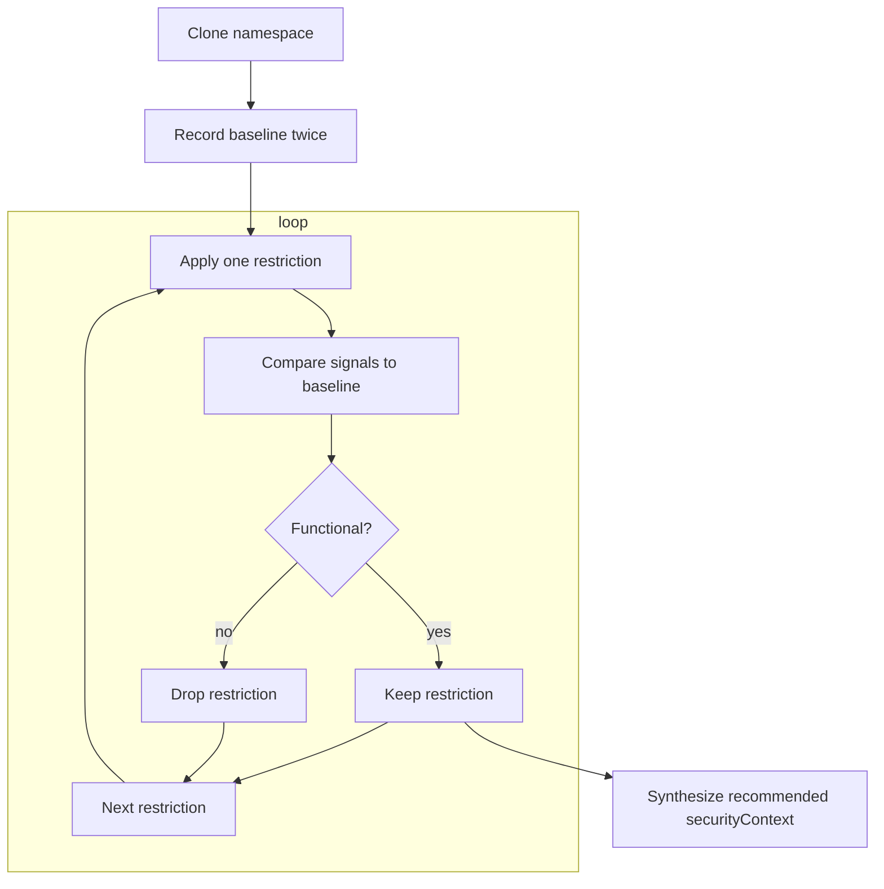

# Automated Kubernetes Workload Hardening Using a Functionality Oracle

> "We just want to deploy securely — but end up fixing someone else's YAML"

Mathias Petermann &nbsp; <small>&lt;mathias.petermann@gmail.com&gt;</small>

Sebastian Graf &nbsp; <small>&lt;sebastian.graf@fhnw.ch&gt;</small>

School of Computer Science, FHNW

September 2026

---
layout: two-cols
---

## Two Roles, one goal

::left::

> "hey claude, generate me an application and push it to prod"

::right::

> "I know that business value is created above... however I really would like to offer throughout reliable services."

<!--
Platform Owner:
- Offer reliable, secure service even on shared instances..
- black box workloads
- people do not really know what to do  / they want
Application Creator:
- Ship business code asap and without problems
- many agentic workloads
- variaty of oci images with all kinds of characteristics
-->

---
layout: image-right
image: /workloadperspective.svg
backgroundSize: 20em 80%
---

## The gap

Responsibilities of Platform and Application is distributed over teams:

- on top: business teams focussing on application
  - focus on business requirements best
  - focus not on platform best practices
- on bottom: platform team, caring about platform for multiple applications
  - no / few application knowledge
  - need to guarantee integrity and resilience of entire platform

<!--
- Use Case: Platform team deployes internal / third party workload
  - Application not really known to platform owner
  - Howerver: platform owner wants to have secure deployed workloads not interfering with other workloads
  - securityContext to rescue...but how to apply?
Credit: https://martinfowler.com/articles/platform-teams-stuff-done.html
-->

---
layout: image-left
image: /theres-no-container.jpg
backgroundSize: contain
---

## In Linux, how the kernel guardrails containers

Containers are not intended to isolate against the host without dedicated settings:

- on kernel-level: 
`cgroups`, `chroot`, `namespaces`

If not set, workloads on the same host might interfer with each other.

<!--
chroot, cgroups and namespaces...
-->

---
layout: two-cols
---

## In the K8s-world...

The fear of all platform engineering: 
> Multiple containers in various namespaces run on different nodes operated by distinct teams...

`securityContext` to the rescue:

Restrict the pod against the host is possible via security contexts (and mostly Linux capabilities under the hood).

::right::

| Field | Description |
| --- | --- |
| `allowPrivilegeEscalation` | Controls whether a process can gain more privileges than its parent, such as via setuid binaries. Container level only. |
| `capabilities` | Allows fine-grained control over Linux capabilities (e.g., `NET_ADMIN`, `SYS_TIME`). Container level only. |
| `fsGroup` | Defines a group ID used for setting group ownership of mounted volumes. Pod-level only. |
| `fsGroupChangePolicy` | Defines behavior of changing ownership and permission of the volume before being exposed inside Pod. Pod-level only. |
| `privileged` | Grants the container full access to the host, disabling most isolation mechanisms. Only available at the Container level. |
| `readOnlyRootFilesystem` | Mounts the containers root file system as read-only. Prevents write access to root-level paths. Container level only. |
| `runAsGroup` | Specifies the GID to run the container process. Useful for filesystem permissions. Applicable at Pod or Container level. |
| `runAsNonRoot` | Ensures the container does not run as root (user ID 0). Kubernetes will reject the Pod if no user ID is set. Applicable at Pod or Container level. |
| `runAsUser` | Specifies the UID to run the entrypoint of the container process. Applicable at Pod or Container level. |
| `seLinuxOptions` | Specifies SELinux labels for process confinement. Requires SELinux-enabled hosts. Usable at Pod or Container level. |
| `seccompProfile` | Applies a Seccomp profile to limit available syscalls. Usable at Pod or Container level. |
| `supplementalGroups` | List of additional GIDs the container will be part of. Useful for shared volume access. Pod-level only. |
| `supplementalGroupsPolicy` | Defines how supplemental groups are calculated. Promoted to Beta in Kubernetes 1.33. |
| `sysctls` | Defines kernel parameters for the Pod. Only safe, allow-listed sysctls are permitted. Pod-level only. |

<!--
`securityContext` cuts the interference surface by restricting the process within the runtime:
  - non-root users
  - read-only root filesystems
  - dropped Linux capabilities
-->

---
layout: default
---

## Choosing the correct security context is hard ...

...even if you know the application well ...

Ref: https://learnkube.com/security-contexts 

---
layout: two-cols
---

## The problems

- No **generic, automated** way to prove a workload still works under restrictive settings.
- Every restriction is a gamble: it might break the app at runtime.

> **Goal:** maximize security without breaking functionality — automatically.

 <!--
`securityContext` are quite powerful
- Restrictions **only fail at runtime** — no compile-time, no static analysis.
- Conventional verification needs app-specific knowledge + integration tests.
- However, when applied manually → error-prone and often skipped.
-->

---
layout: image-right
image: /orakle-of-funk.png
backgroundSize: contain
---

## The idea 

Treat functional correctness as a **black box** and **orakle** about its correctness:

1. Record a **baseline** of a known-good workload.
2. Apply **one** runtime restriction at a time.
3. **Compare** observed behavior against the baseline.
4. Aggregate successful restrictions → recommended `securityContext`.

--> No internal knowledge of the app required.. 
--> (however...correct behaviour is assumed, not proved...) 
-->(well...was software correctness ever proved?)

---

## What Comes Out

A ready-to-apply, workload-agnostic recommendation:

- `podSecurityContext` + container `securityContext`
- Built only from restrictions that provably kept the app working
- Enables **secure-by-default** deployments

---

## The Loop

<!--
as svg
-->
---

## Observable Signals

| Category | Signals |
| --- | --- |
| **Logs** | container logs via kube-api |
| **Pod health** | Startup-, Liveness-, Readiness-Probes |
| **Events** | Restarts, CrashLoopBackOff, probe failures |
| **Metrics** | CPU / memory from kubelet |

> Probes alone prove "running", not "correct".

---

## Metrics · Statistical Summaries

- Collected per **kubelet**, ~15s resolution.
- **DTW** evaluated → good for shifted patterns, but needs interpretation.
- **Statistical summaries** chosen: mean, median, std-dev, variance on normalized data.
- Metrics alone are **not** sufficient — used to spot outliers only.

<!--
metriken sind vernachlässigbar und nicht genug zuverlässig
-> logs
-->

---

## Logs · Drain Template Matching

- Parse logs into templates with the **Drain** algorithm.
- Train on **two** baseline recordings (so dynamic fields become `<*>`).
- Match check-run logs against baseline templates.
- Unmatched lines → anomalies; re-mined to collapse recurring errors.

Reliable even for workloads that stayed **Ready** — catches silent failures.

---

## Placeholder für LLM

Lorem ipsum

---

## Implementation: Operator Architecture

- **Operator SDK** Kubernetes operator, two CRDs:
  - `WorkloadHardeningCheck` — one workload
  - `NamespaceHardeningCheck` — all workloads in a namespace
- All runs execute in **cloned namespaces** (isolation preserved).
- Status tracked via `StatusConditions`; logs/metrics in **ValKey** (1-day expiry).

---

## Execution Flow

To be inserted: achitekturubersicht

---

## Evaluation Workloads

- **Real-world:** Prometheus, ArgoCD, MariaDB, Podtato-Head (official Helm charts).
- **NGINX scenarios:** root, non-root unprivileged, read-only root + emptyDir.
- **Purpose-built:** chown, privilege escalation, filesystem writes, port binding.

---

## Concrete Example

recommendation for adaption, thesis page 34

---

## Limitations

- Concurrency complicates status updates & resource versioning.
- Complex topologies (distributed systems, CRDs) hard to clone faithfully.
- Evaluation duration balances coverage vs. feedback loop.
- Metrics alone insufficient for functional correctness.

---

## Key Findings

- Stateless / loosely coupled workloads easiest to harden.
- Multi-component apps need namespace-level checks.
- **Log heuristics detected deviations even when pods stayed Ready.**
- Runtime variance matters (e.g. unprivileged port binding differs by runtime).
- Stateful workloads can be hardened with careful cloning.

---

## Takeaways

- Functionality-based hardening is **feasible** with minimal assumptions.
- Logs + probes + metrics together form a robust oracle.
- Operator integrates natively, gives actionable workload-agnostic recommendations.

TBI: Link to repo

---

## Questions?

<small>[xkcd 1256 — Questions](https://xkcd.com/1256/) by Randall Munroe, licensed under [CC BY-NC 2.5](https://creativecommons.org/licenses/by-nc/2.5/)</small>

<small>Slides built with [Slidev](https://sli.dev) and the [FHNW theme](https://github.com/peschmae/slidev-theme-fhnw).</small>
