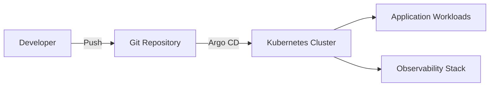

# Swiss Cloud Native Day 2026

Your Name &nbsp; <small>&lt;your.email@fhnw.ch&gt;</small>

University of Applied Sciences and Arts, Northwestern Switzerland

August 2026

---

# Agenda

1. Background and motivation
2. Architecture overview
3. Implementation highlights
4. Lessons learned and outlook

---
layout: section
---

# Background and Motivation

---

# The Problem

- Cloud-native systems are becoming increasingly complex
- **Observability**, **security**, and **cost efficiency** are critical
- Existing tooling often creates fragmented workflows
- Students and practitioners need hands-on, reproducible examples

---
layout: two-cols
---

# Goals

- Build an end-to-end demo platform
- Integrate Kubernetes, GitOps, and observability
- Provide clear educational material
- Foster collaboration between research and industry

::right::

# Non-Goals

- Replace production-grade platforms
- Cover every cloud provider
- Deep-dive into proprietary services

---
layout: section
---

# Architecture Overview

---

# High-Level Design



- GitOps-driven deployments via Argo CD
- Container workloads on Kubernetes
- Metrics, logs, and traces with OpenTelemetry

---

# Technology Stack

| Layer | Tool |
| --- | --- |
| Orchestration | Kubernetes |
| GitOps | Argo CD |
| Observability | OpenTelemetry, Prometheus, Grafana |
| CI/CD | GitHub Actions |
| Infrastructure | Terraform |

---
layout: section
---

# Implementation Highlights

---

# Code Example

A minimal Kubernetes deployment manifest:

```yaml
apiVersion: apps/v1
kind: Deployment
metadata:
  name: demo-app
spec:
  replicas: 3
  selector:
    matchLabels:
      app: demo-app
  template:
    metadata:
      labels:
        app: demo-app
    spec:
      containers:
        - name: app
          image: ghcr.io/example/demo-app:latest
          ports:
            - containerPort: 8080
```

---
layout: two-cols
---

# What Worked Well

- Declarative infrastructure as code
- Automated rollback with Argo CD
- Open standards prevent vendor lock-in
- Strong community support

::right::

# Challenges

- Steep learning curve for beginners
- Debugging distributed traces
- Resource constraints in shared clusters
- Keeping documentation in sync

---

# Key Takeaways

- Start small and iterate
- Invest in observability early
- Use GitOps for reproducibility
- Document assumptions and trade-offs

---
layout: end
---

# Thank you for your attention

Questions and Feedback

<small>Slides built with [Slidev](https://sli.dev) and the [FHNW theme](https://github.com/peschmae/slidev-theme-fhnw).</small>
