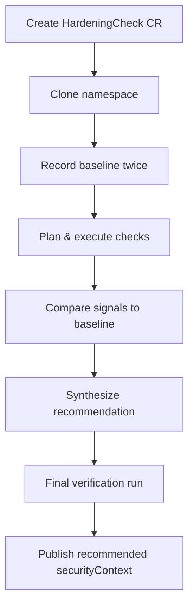

# Automated Kubernetes Workload Hardening Using a Functionality Oracle

Mathias Petermann &nbsp; <small>&lt;mathias.petermann@gmail.com&gt;</small>

Academic Supervisor: Sebastian Graf &nbsp; <small>&lt;sebastian.graf@fhnw.ch&gt;</small>

School of Computer Science, FHNW

September 2025

---

# Agenda

1. Problem and motivation
2. Research objectives
3. Functionality oracle design
4. System architecture
5. Implementation highlights
6. Evaluation and results
7. Conclusion and future work

---
layout: section
---

# Problem and Motivation

---

# The Challenge

- Kubernetes provides powerful runtime restrictions via `securityContext`.
- Restrictions can cause **unexpected application failures** that only appear at runtime.
- Conventional testing requires application-specific knowledge and integration tests.
- There is **no generic, automated way** to verify that a workload remains functional under restrictive settings.

> *Determining whether an application continues to function correctly under increasingly restrictive settings remains a challenge.*

---

# Why It Matters

- Containers are not secure by isolation alone.
- `securityContext` settings reduce attack surface:
  - non-root users
  - read-only root filesystems
  - dropped Linux capabilities
- Applying them manually is error-prone and often neglected.
- The goal: **maximize security without breaking functionality**.

---
layout: section
---

# Research Objectives

---

# Research Questions

1. **Classification** — What methods exist to group workloads for standardized testing?
2. **Heuristics** — What heuristics can evaluate workload functionality when runtime constraints change?
3. **Iteration** — How can these heuristics automate iterative restrictions and systematic verification?
4. **Architecture** — How to balance CI/CD automation with the flexibility of a Kubernetes operator?

---

# Scope

- Focus on container runtime hardening using `securityContext` and resource limits.
- Exclude RBAC and Windows-specific configurations.
- Target applications running on Linux-based Kubernetes worker nodes.

---
layout: section
---

# Functionality Oracle Design

---

# Core Idea

- Treat functional correctness as a **black-box** problem.
- Record a **baseline** of a known-good workload.
- Apply one runtime restriction at a time.
- Compare observed behavior against the baseline.
- Aggregate successful restrictions into a recommended `securityContext`.

---

# Signals Used

| Category | Signals |
| --- | --- |
| **Pod healthiness** | Startup-, Liveness-, Readiness-Probes |
| **Kubernetes events** | Restarts, CrashLoopBackOff, probe failures |
| **Logs** | Structured / unstructured container logs |
| **Resource metrics** | CPU and memory usage from the kubelet |

> Pod phase and probes act as a **hard failure gate**, but they do not prove functional correctness on their own.

---

# Log Analysis with Drain

- Logs are parsed into templates using the **Drain** algorithm.
- Two baseline recordings train the parser on normal log patterns.
- Check-run logs are matched against the baseline templates.
- Unmatched lines are reported as anomalies.

<small>This approach proved highly reliable in detecting functional deviations, even for workloads that stayed Ready.</small>

---

# Metrics Comparison

- Resource metrics are collected directly from each Node’s kubelet.
- Two approaches were evaluated:
  - **Dynamic Time Warping (DTW)** — matches shifted time-series patterns.
  - **Statistical summaries** — mean, median, standard deviation, variance.
- Statistical summaries were chosen for their simplicity and interpretability with short recordings.

---

# Four Test Cases

| ID | Test | Source | Priority |
| --- | --- | --- | --- |
| **TC-01** | Pod stability (no crashes) | Probes | High |
| **TC-02** | Pod readiness | Probes | High |
| **TC-03** | Log pattern matching | Logs | Medium |
| **TC-04** | Resource usage patterns | Metrics | Low |

A failing check is excluded from the final recommendation.

---
layout: section
---

# System Architecture

---

# Kubernetes Operator

- Implemented as a **Kubernetes Operator** using the Operator SDK.
- Two custom resources coordinate execution:
  - `WorkloadHardeningCheck` — targets one workload.
  - `NamespaceHardeningCheck` — hardens all workloads in a namespace.
- All checks run in **cloned namespaces**, preserving isolation.

---

# Execution Flow

---
layout: section
---

# Implementation Highlights

---

# Signal Collection

- **Logs**: streamed via the Kubernetes API for each container.
- **Metrics**: gathered directly from kubelet on each Node.
- **Storage**: signals stored temporarily in **ValKey** with one-day expiry.
- Status updates kept lightweight to avoid API server load.

---

# Check Design

- Checks map to `securityContext` / `podSecurityContext` attributes.
- **Isolated checks**: `readOnlyRootFilesystem`, `allowPrivilegeEscalation`, `capabilities.drop`.
- **Grouped checks**: `runAsUser`, `runAsGroup`, `fsGroup`, `runAsNonRoot` must be set consistently.
- Execution modes: **sequential** or **parallel**.

---
layout: section
---

# Evaluation and Results

---

# Evaluation Workloads

- **Real-world**: Prometheus, ArgoCD, MariaDB, Podtato-Head.
- **NGINX scenarios**: default root, non-root unprivileged, read-only root with emptyDir.
- **Purpose-built workloads**: isolated tests for chown, privilege escalation, filesystem writes, port binding.

---

# Key Findings

- Stateless and loosely coupled workloads are easiest to harden.
- Multi-component applications require namespace-level checks.
- **Log-based heuristics detected deviations even when pods stayed Ready.**
- Container runtime variance matters (e.g., unprivileged port binding).
- Stateful workloads can be hardened, but require careful cloning.

---

# Observations and Limitations

- Concurrency complicates status updates and resource versioning.
- Complex topologies (distributed systems, CRDs) are harder to clone faithfully.
- The evaluation duration must balance coverage and feedback loop.
- Metrics alone are not sufficient to determine functional correctness.

---
layout: section
---

# Conclusion and Future Work

---

# Conclusion

- Functionality-based Kubernetes workload hardening is **feasible** with minimal assumptions.
- The operator integrates natively and provides actionable, workload-agnostic recommendations.
- Logs + probes + metrics together form a robust functionality oracle.
- The approach enables **secure-by-default deployments** without handcrafted test logic.

---

# Future Work

- Dedicated CLI for CI/CD integration.
- Separate `WorkloadHardeningReport` resource for cleaner reporting.
- Consolidated baseline recording for namespace-level checks.
- Integration of LLMs for semantic log analysis.
- Regression testing across application upgrades.
- Support for more complex, interdependent workloads and CRDs.

---
layout: end
---

# Any questions?

<small>[xkcd 1256 — Questions](https://xkcd.com/1256/) by Randall Munroe, licensed under [CC BY-NC 2.5](https://creativecommons.org/licenses/by-nc/2.5/)</small>

<small>Slides built with [Slidev](https://sli.dev) and the [FHNW theme](https://github.com/peschmae/slidev-theme-fhnw).</small>
